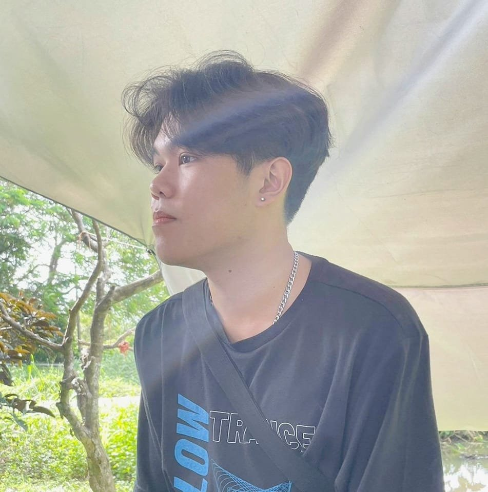

<!-- Banner / Cover -->

  

<h1 align="center">Hi, I’m <strong>Phanupong Suwan</strong> </h1>

  <strong>Software Tester • Python & Robot Framework • Continuous Learner</strong> 
  <em>“Passionate about building reliable test automation.”</em>

  

---

## 🚀 About Me
- 🧑‍💻 Currently building a **test automation project**  
- 🛠 Skilled in **Python** & **Robot Framework**  
- 🌱 Exploring more in **software testing** and **DevOps**  
- 🎯 2025 Goal: Land an **internship** in software testing / QA  
- 📫 Contact: phanupongsuwan88@gmail.com | [LinkedIn](https://www.instagram.com/ssstephenking_/)

---

## 🧰 Tech Stack & Tools

| Category | Primary Tools | Comfortable | Currently Exploring |
|----------|---------------|-------------|---------------------|
| Test Automation |   |  |  |
| Test Management |  |  |  |
| CI/CD |  |  |  |
| Reporting / Monitoring |  |  |  |

---

## 📌 Featured Projects
| Project | Tech / Tools | Highlights | Links |
|---------|--------------|------------|-------|
| **Automated Web Testing Suite** | Python · Robot Framework · Selenium | 🛠 Automated regression tests for e-commerce; reduced manual testing time by 70% | [Repo](⟪url⟫) · [Report](⟪url⟫) |
| **API Testing Framework** | Python · Robot Framework · Requests · Allure | 🔗 Reusable API test framework with Allure reporting; integrated CI/CD | [Repo](⟪url⟫) |
| **Performance Testing Dashboard** | JMeter · Grafana · Prometheus | 📊 Load tests on microservices; real-time dashboard visualization | [Case Study](⟪url⟫) |

---

## 🎓 Education
- 🏫 **Maejo University** — B.Sc. in Information Technology (Graduated 2025)  
- 📍 San Sai District, Chiang Mai, Thailand

---

## 🤝 Let’s Connect
> **“Great products are built by great people working together.”**

- 💌 Email: phanupongsuwan88@gmail.com  
- 📱 Phone: 094-486-1169  
-  

---

  

